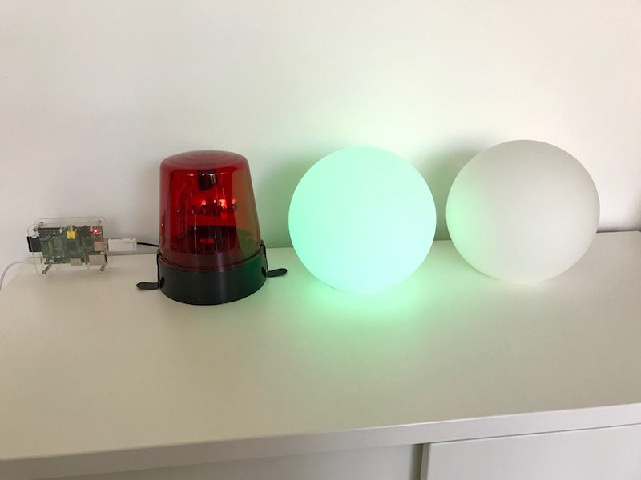

# Jenkins Ampel

**Hint: 'Ampel' is the german word for traffic light.**

This piece of code switches lights, that are physically plugged into a USB controllable wall socket, on or off, depending on failed Jenkins jobs. This project runs on a Raspberry Pi 1 at Consort IT but feel free to use every system where Ruby is available.



## Dependencies

1. Ruby >= 2.0

2. Bundler

3. [Controllable USB wall socket](https://www.amazon.de/gp/product/B00BAQZJ4K/ref=oh_aui_detailpage_o06_s01?ie=UTF8&psc=1)

4. [SiS-PM  (Silver Shield PM) Control for Linux 3.0](http://sispmctl.sourceforge.net/)

## Howto use it?

```
bundle install
```

Create a *.env* file and place three environment variables in it.

```
touch .env
```

```
JENKINS_JOBS_URI=https://your.jenkins.uri
JENKINS_USER=jenkins-user
JENKINS_PASS=jenkins-pass
```

Fire it up.

```
bin/ampel
```

Add a cron job to your system.

```
*/1 * * * *  ruby /home/pi/ampel/bin/ampel 2>/dev/null
```

## Ouput

```
OK: Everything is fine! Green light is on. :-)
```

## Contribute

1. Fork it
2. Create a feature branch
3. Write awesome code
4. Test your awesome code (***bundle exec guard*** and ***rspec*** are your friends)
5. Commit your changes
6. Push to the branch
7. Create new pull request

Feel free to contact us and ask questions.
